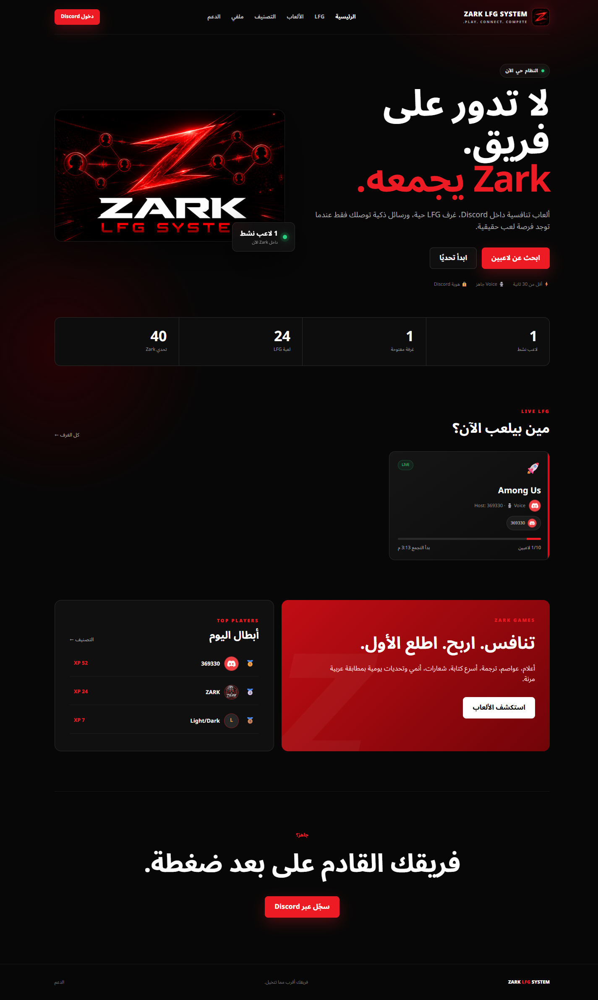
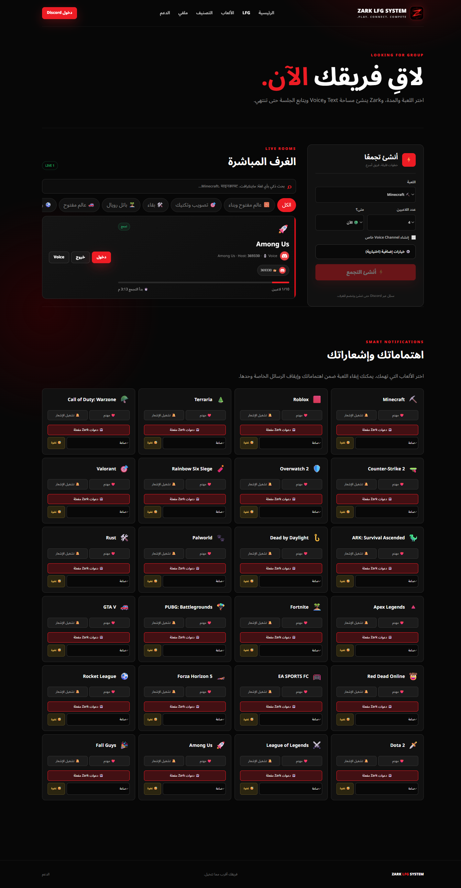
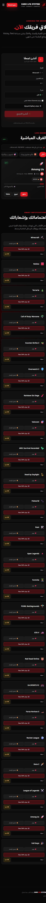
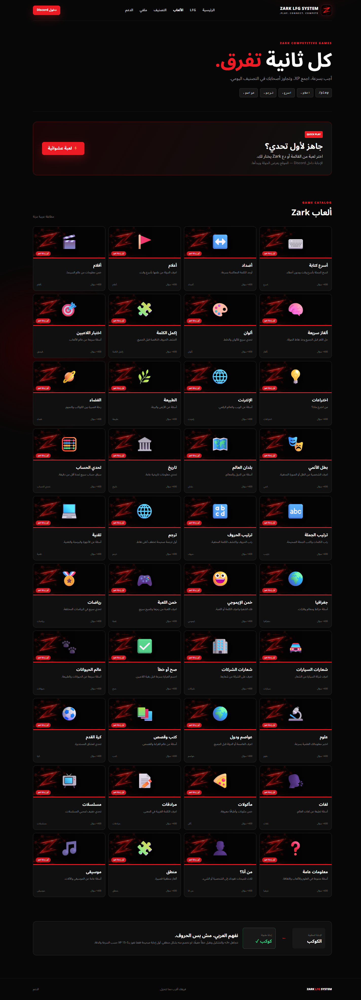
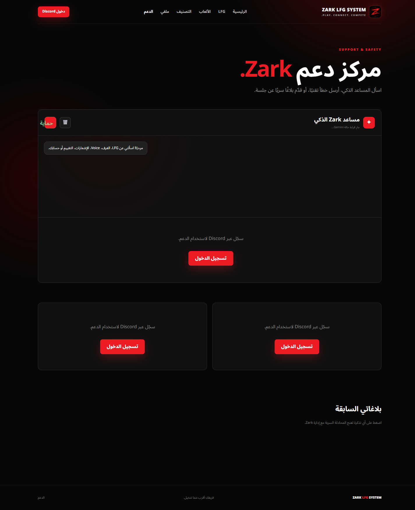

# دليل استخدام Zark LFG System

هذا الدليل يشرح استخدام موقع Zark والبوت بسرعة. الصور التقطت من الموقع الفعلي، أما خطوات الدخول والإنشاء والإرسال فلا تنفّذها إلا بحسابك.

## 1. تسجيل الدخول



1. افتح `zark-ps.com`.
2. اضغط **دخول Discord** من أعلى الصفحة أو زر **سجّل عبر Discord**.
3. اختر حساب Discord المرتبط بالسيرفر ثم وافق على الدخول.
4. بعد العودة للموقع يظهر اسمك وصورتك وتصبح أدوات الغرف والاهتمامات متاحة.

## 2. اختيار الألعاب المهتم بها



1. افتح تبويب **LFG**.
2. انزل إلى قسم **اهتماماتك وإشعاراتك**.
3. عند اللعبة التي تحبها اضغط **مهتم** ثم فعّل **إشعار**.
4. عند إنشاء أي غرفة لهذه اللعبة تصلك دعوة خاصة من البوت؛ استخدم **غفوة** إذا أردت إيقافها مؤقتًا، أو **غير مهتم** لإلغائها.

## 3. إنشاء غرفة من الموقع


1. من صفحة **LFG** افتح بطاقة **أنشئ تجمعًا**.
2. اختر اللعبة وعدد اللاعبين ووقت اللعب: **الآن** أو **لاحقًا**.
3. للـRoblox اكتب اسم الـMap، ويمكنك إضافة Game Mode ووصف.
4. فعّل Voice إن أردت قناة صوتية خاصة، ثم اضغط **أنشئ التجمع**.
5. ينشئ Zark إعلان الغرفة وقنواتها ويرسل دعوات خاصة للمهتمين.

## 4. من الهاتف



1. افتح الموقع من المتصفح على الهاتف وسجّل Discord.
2. افتح القائمة ☰ ثم **LFG**.
3. اختَر اللعبة أو ابحث عن غرفة، ثم اضغط **دخول**.
4. بعد إنشاء الغرفة أو دخولها استخدم زر **Voice** للانتقال إلى Discord.

## 5. ألعاب البوت



استخدم Discord:

```text
/play game:flags rounds:3 seconds:15
/play help
/help-plus
```

- `game`: اختر لعبة من ألعاب Zark.
- `rounds`: من جولة واحدة إلى 10 جولات.
- `seconds`: وقت الإجابة من 10 إلى 60 ثانية.
- لا يمكن بدء لعبة ثانية في نفس الشات حتى تنتهي الحالية.

## 6. التقييم بعد الغرفة

1. بعد إكمال الغرفة تصل رسالة خاصة من Zark.
2. قيّم الغرفة من 1 إلى 5 نجوم.
3. اختر لاعبًا ثم قيّمه إن رغبت.
4. إذا لا تريد التقييم اختر **إنهاء**. لا يمكن تغيير تقييم شخص آخر بعد إرساله إلا عند ظهور خيار التعديل في الجلسة.

## 7. البلاغات والدعم



1. افتح **الدعم** من القائمة.
2. استخدم **بلاغ لاعب** لسلوك عضو، أو **إرسال خطأ** لمشكلة في البوت أو الموقع.
3. اكتب عنوانًا ووصفًا واضحًا بدون كلمات مرور أو بيانات حساسة.
4. بعد الإرسال تظهر التذكرة في الصفحة؛ تستطيع متابعة رد الإدارة داخل المحادثة نفسها.
5. يمكنك أيضًا استخدام `/lfg report` أو `/lfg bug` في Discord.

## نصائح سريعة

- لا تفعّل إشعارات لعبة إلا إذا كنت تريد دعواتها في الخاص.
- حدّث وقت فراغك من `/availability` أو `/وقت-فراغي` حتى يساعدك التجميع الذكي.
- لا تفتح روابط جوائز أو Crypto من أعضاء أو حسابات مخترقة؛ Zark يحذف الرسائل المشبوهة وينبّه الإدارة.
