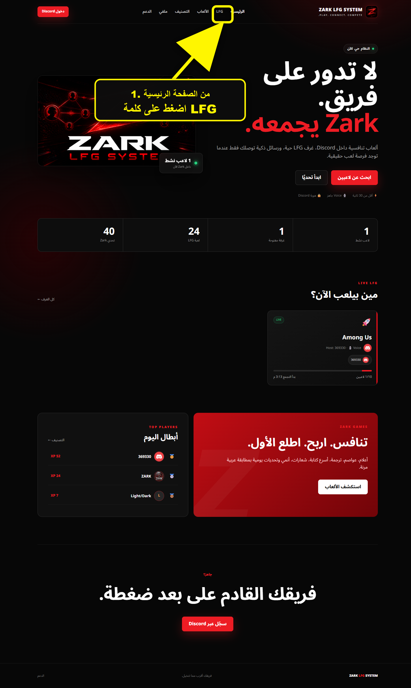
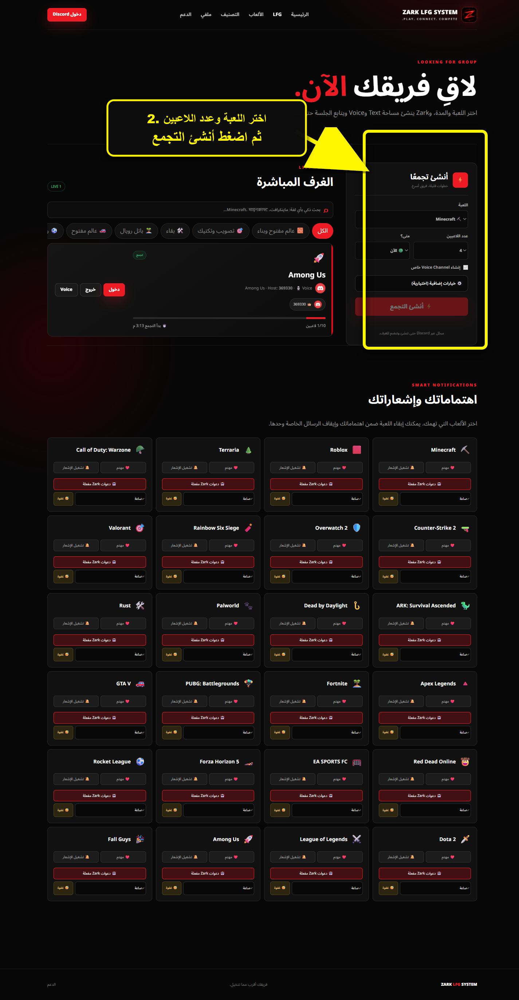
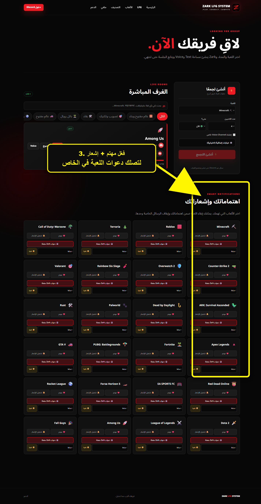
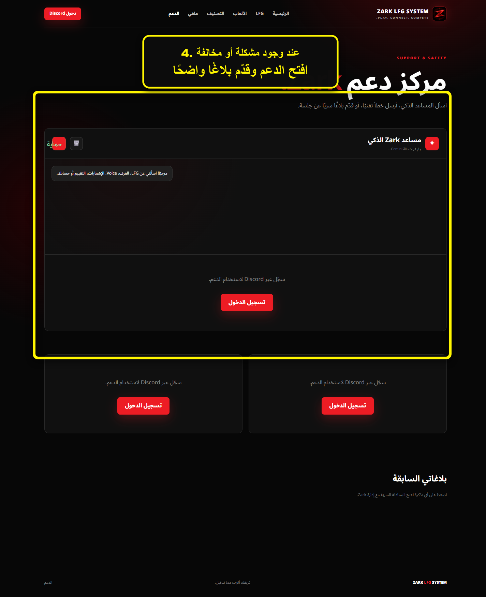
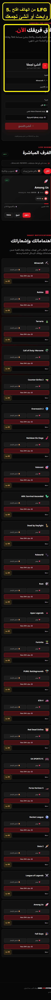

# مشاهد فيديو شرح Zark

هذه صور مشروحة جاهزة للمونتاج. استخدم كل مشهد 4 إلى 6 ثوانٍ مع تسجيل صوتي قصير.

## 1. فتح LFG

التعليق: «من الصفحة الرئيسية، اضغط على LFG حتى تبدأ البحث عن فريق أو تنشئ تجمعك.»

## 2. إنشاء غرفة

التعليق: «اختر اللعبة وعدد اللاعبين، ثم أنشئ التجمع. البوت يجهز الإعلان وVoice تلقائيًا.»

## 3. الاهتمامات والإشعارات

التعليق: «اضغط مهتم وفعّل الإشعار للعبة التي تحبها، وستصلك دعواتها مباشرة في الخاص.»

## 4. الدعم والبلاغات

التعليق: «إذا واجهت مشكلة أو مخالفة، افتح الدعم، اشرح البلاغ بوضوح، وتابع رد الإدارة من نفس الصفحة.»

## 5. استخدام الهاتف

التعليق: «من الهاتف افتح LFG، ابحث عن غرفة أو أنشئ تجمعك، ثم ادخل Voice من Discord.»

## اقتراح ترتيب الفيديو

1. شعار Zark — ثانيتان.
2. المشاهد الخمسة بالترتيب — 25 ثانية تقريبًا.
3. لقطة أخيرة: «سجّل عبر Discord وابدأ الآن» — 3 ثوانٍ.
